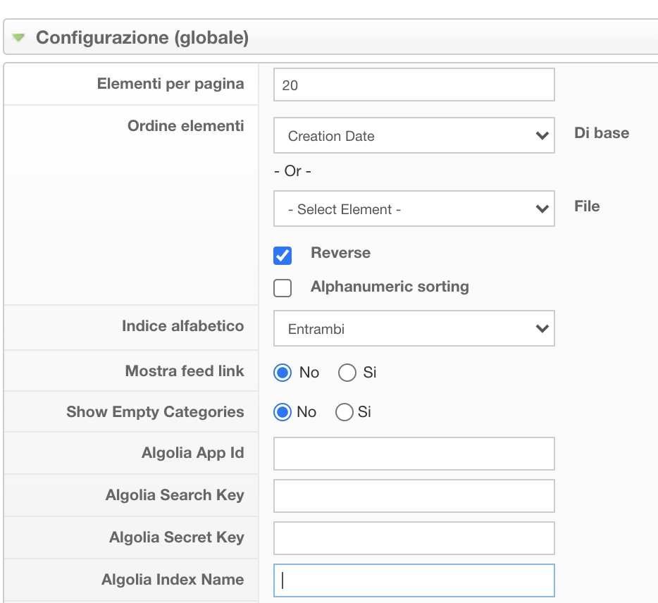
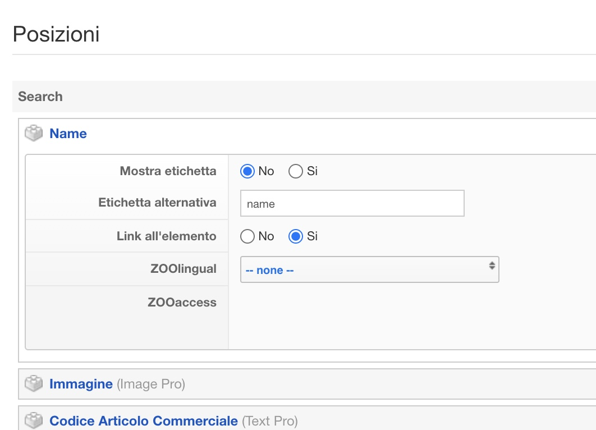

# Algolia integration for ZOO

Plugin to allow any ZOO item to be indexed into an algolia index.
Each ZOO application has its own Algolia configuration, allowing for different indexes per-application.

Each ZOO type can be mapped through a simple drag and drop configuration using the standard ZOO layouts.

## Installation

Download [a release here on github](https://github.com/Weble/ZOOalgolia/releases) and install it using Joomla Installer.

## Usage

1. Install the plugin
2. Enable it
3. Go into your ZOO application instance configuration and fill in the required settings 
4. Go into the ZOO layout configuration and map your type. Use the "Label" to set the key of that property. 

Now, every time you create / save / delete an item from zoo, it will be instantly indexed in Algolia.

## Console Commands

If you have [JoomlaCommands](https://github.com/Weble/JoomlaCommands) installed, the plugin provides an handy `algolia:sync` command to deal with syncing from the command line

```php bin/console algolia:sync {--app=[ID] --type=[type] --ids=1,2,3}```

If you have **Joomla 4**, [JoomlaCommands](https://github.com/Weble/JoomlaCommands) is not required. Use native Joomla commands instead.

````php cli/joomla.php algolia:sync````

## Build from source

```./build.sh```
